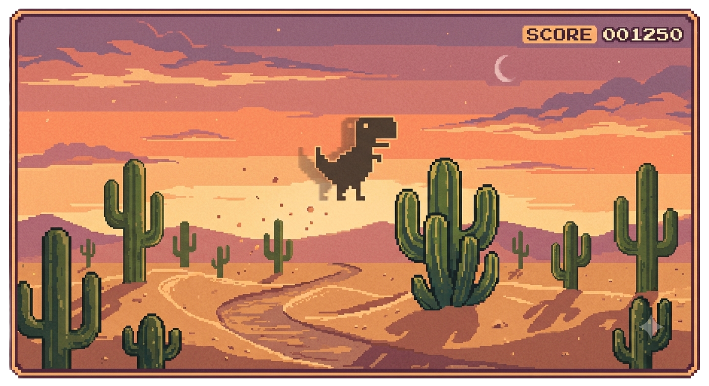
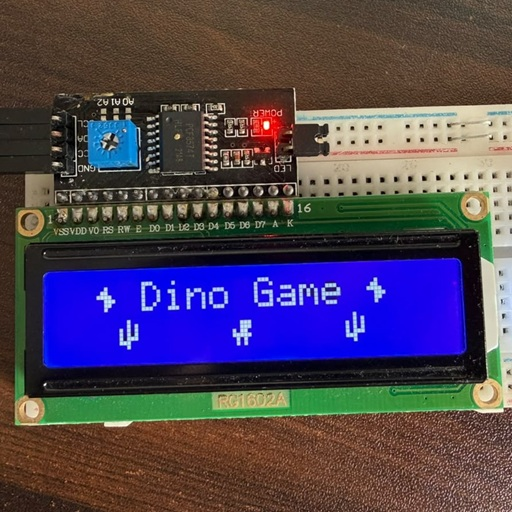
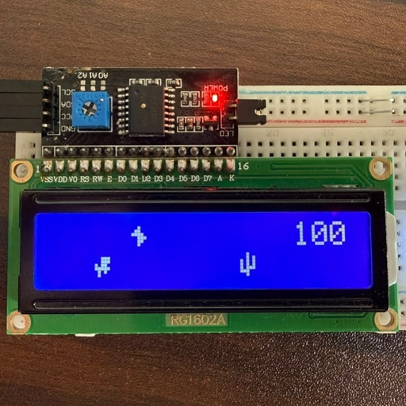
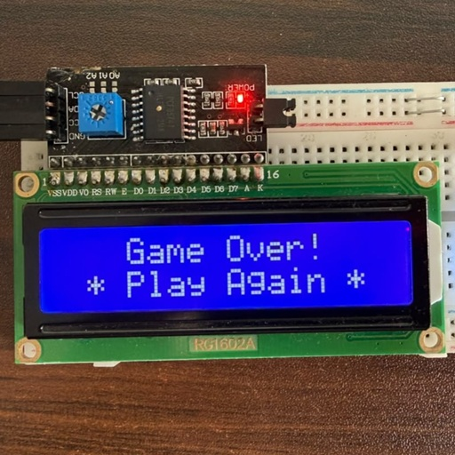
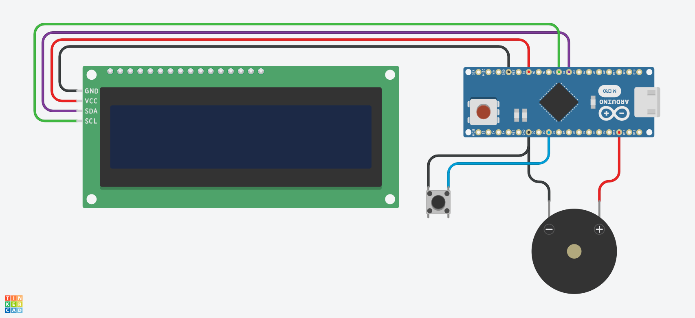

# 🦖 Arduino Dino Game

Jump and survive!

| **Splash Screen**                             | **Gameplay (Jump / Dodge)**                | **Game Over**                        |
| --------------------------------------------- | ------------------------------------------ | ------------------------------------ |
|  |  |  |

---

## 🛠️ Features

- ⚡ **Memory Efficient:** Rewritten to use minimal RAM so it runs smoothly.
- 🏃‍♂️ **Smooth Animation:** Quick character updates with zero lag.
- 📈 **Rising Difficulty:** Game speed increases automatically as your score goes up.

## 🔌 Circuit Diagram

Connect your parts according to this layout:

### 🔌 Pin Mapping

| Component        | Arduino Pin | Description   |
| ---------------- | ----------- | ------------- |
| **I2C LCD VCC**  | `5V`        | Power         |
| **I2C LCD GND**  | `GND`       | Ground        |
| **I2C LCD SDA**  | `A4`        | Data Line     |
| **I2C LCD SCL**  | `A5`        | Clock Line    |
| **Push Button**  | `D3`        | Jump Button   |
| **Piezo Buzzer** | `D11`       | Sound Effects |

---

## 👤 Author

Made with 💻 and ☕ by [@udham2511](https://www.github.com/udham2511)

## 📜 License

This project is open-source and available under the **MIT License**.
